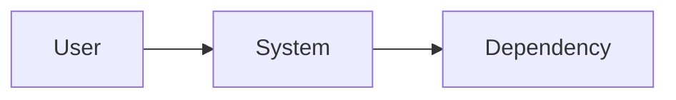
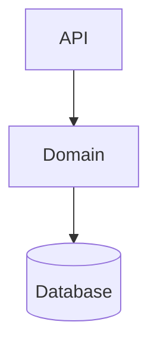

# Architecture overview: <system>

Status: current as of <YYYY-MM-DD>
Related: docs/product/requirements.md, docs/decisions/

## Purpose and drivers

What this system does, in three sentences. Then the constraints that actually shaped it,
each traceable to a requirement.

| Driver | Value | Effect on the design |
| --- | --- | --- |

## Context

Who and what this system talks to.

## Components

| Component | Owns | Interface | Depends on | Data it owns |
| --- | --- | --- | --- | --- |

Dependencies point one way. Note any cycle here as a known defect with a plan, or fix it.

## Shape and why

The deployment shape, communication style, consistency model, and storage choices, each
with the requirement that forced it where it departs from the defaults in the decision
framework. Link the ADR rather than repeating the reasoning.

## Cross-cutting decisions

- Identity and authorization model.
- Error, timeout, and retry semantics.
- Idempotency strategy.
- Observability: what is logged, measured, traced, and alerted on.
- Configuration and secrets.
- Data lifecycle, classification, and retention.

## Failure behavior

| Dependency | When it is down | When it is slow | Blast radius |
| --- | --- | --- | --- |

## Scale and cost

Current and expected volume, the component that hits its limit first, the leading indicator
for that limit, and the estimated monthly cost at expected volume.

## What this architecture is bad at

The honest list. Which likely future requirement would be painful, and what the escape
route is. Every design has this section; the ones that omit it just surprise people later.

## Decisions

| ADR | Decision | Status |
| --- | --- | --- |
