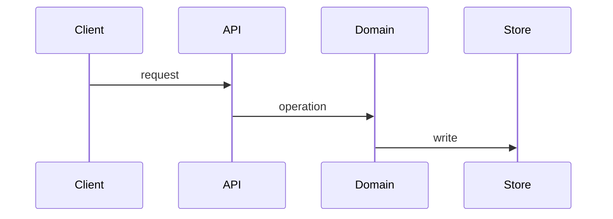

# Technical design: <feature>

Status: draft | approved
Requirement: FR-N
Author: <name>
Last updated: <YYYY-MM-DD>

## Summary

What is being built and the approach, in one paragraph. Someone should be able to read only
this and know whether they need to read the rest.

## Files and interfaces touched

Name them. A design that does not reference the actual code has not been checked against it.

## Contract

The caller-visible surface: endpoint, signature, event, or command.

- Request and response schema, with types and optionality.
- Validation rules, and what happens when they fail.
- Full error set: code, status, when it occurs, what the client should do.
- Authorization: who may call this, and which resource-level check runs.
- Idempotency: is it safe to retry, and how is that keyed?

## Data

Schema changes, constraints, and indexes.

Migration path, in expand and contract steps, with the release each lands in:

1. Add ... (release N, safe under current code)
2. Backfill ... (batched, restartable, expected duration)
3. Switch reads ... (release N+1)
4. Drop ... (release N+2)

Classification and retention for anything new.

## Control flow

Transaction boundaries: what is atomic with what, and what is explicitly not.

## Failure modes

| Step or dependency | Down | Slow | Timeout | Retry safe | User sees | Alerted |
| --- | --- | --- | --- | --- | --- | --- |

If the process dies mid-operation, what state is left and how does it recover?

## Abuse and limits

Rate limits, input bounds, resource ceilings, and what a hostile caller could do with this.

## Observability

- Log events at the boundaries, with fields and without sensitive data.
- Metrics, and the one you would alert on.
- The latency budget for the path, split across its steps.

## Test approach

| Level | What it covers | Where |
| --- | --- | --- |

The end-to-end check that proves the feature works.

## Alternatives considered

What else was viable, and why it lost. Link an ADR if the choice is expensive to reverse.

## Open questions
