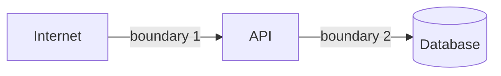

# Threat model: <system or feature>

Last updated: <YYYY-MM-DD>
Scope: what is covered, and explicitly what is not.

## What we are protecting

| Asset | Classification | Why an attacker wants it | Impact if lost or exposed |
| --- | --- | --- | --- |

## Who we are protecting it from

Realistic actors only, with what they already have.

| Actor | Access they start with | Motivation | Capability |
| --- | --- | --- | --- |

An authenticated ordinary user is on this list for every multi-tenant system. They are the
most common real attacker and the easiest one to forget.

## Trust boundaries

Where data crosses from less trusted to more trusted. Each one needs authentication,
authorization, and validation.

| # | Boundary | Controls | Verified by |
| --- | --- | --- | --- |

## Entry points

| Entry point | Reachable by | Authenticated | Rate limited | Input validated |
| --- | --- | --- | --- | --- |

## Threats

One row per threat that is actually reachable. Rank by likelihood times impact.

| # | Threat | Actor | Path | Impact | Control | Residual risk |
| --- | --- | --- | --- | --- | --- | --- |

## Accepted risks

What is not being mitigated, why, who accepted it, and when it should be revisited.

| Risk | Why accepted | Accepted by | Revisit |
| --- | --- | --- | --- |

## Detection

For each significant threat: what signal would show it happening, where that signal lives,
and whether anyone is watching it. A threat with a control but no detection is a threat you
will learn about from a customer.
